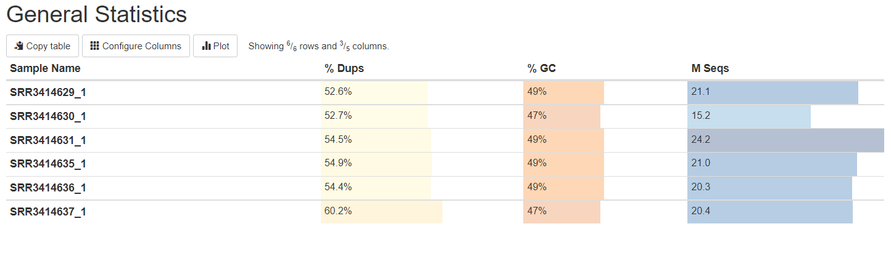
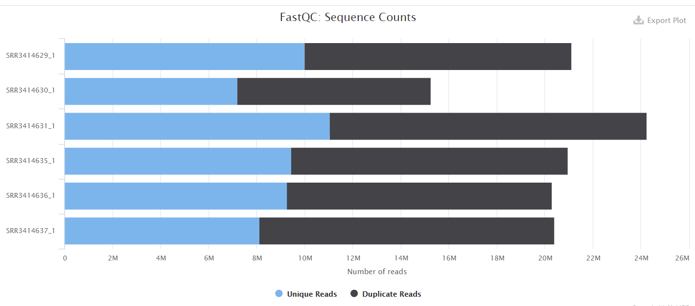
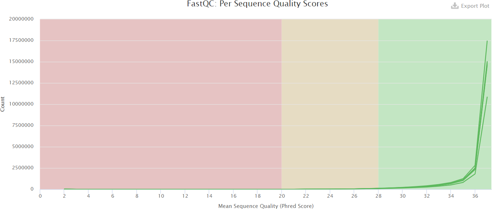
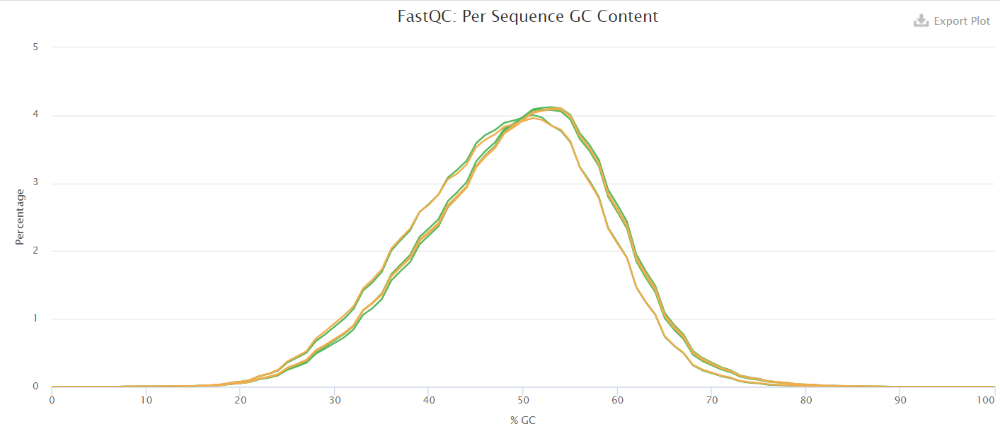
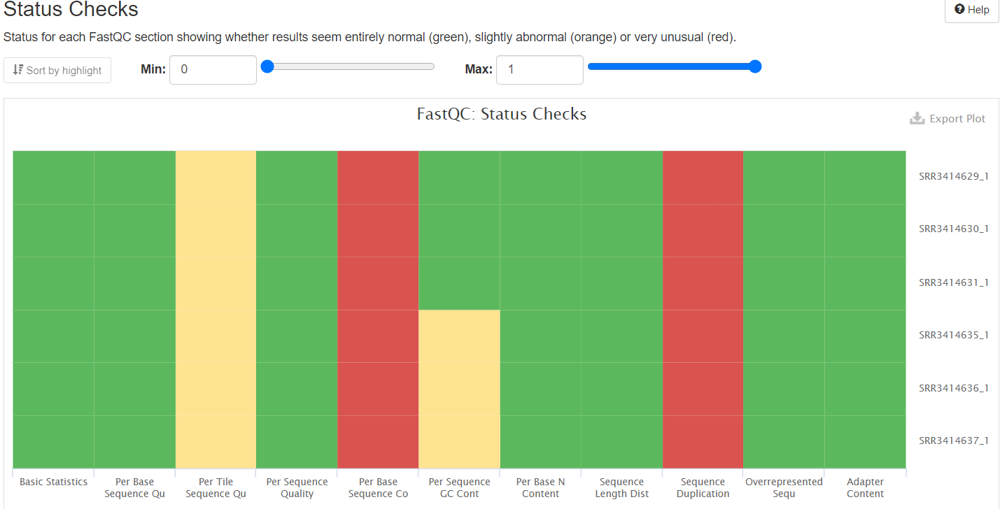
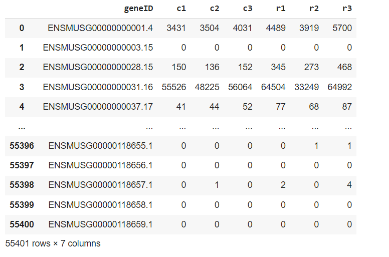

# Домашнее задание № 3

###### Кличко Никита

## Задание № 1

Ссылка на google colab с кодом: https://colab.research.google.com/drive/10iK5RoLPbUpayhWTSY9pEZ1Ubioa_Qtn?usp=sharing

### Отчет MultiQC

 
 
 
 
 

### Таблица ALL_counts и таблица с информацией по каждому образцу

 

| Sample ID | Type | Total reads | Successfully mapped | Uniquely mapped | Total reads (hit the genes) | 
--- | --- | --- | --- | --- | --- 
SRR3414629 | reprogramming | 21106089 | 20510113 | 18375888 | 16049609 | 
SRR3414630 | reprogramming | 15244711 | 14832680 | 13186139 | 11465324 | 
SRR3414631 | reprogramming | 24244069 | 23547686 | 20928945 | 18408851 | 
SRR3414635 | control | 20956475 | 20395865 | 18428317 | 16275997 | 
SRR3414636 | control | 20307147 | 19757059 | 17825380 | 15757580 | 
SRR3414637 | control | 20385570 | 19847291 | 17844858 | 15736978 | 

## Задание № 2